```r
knitr::opts_chunk$set(warning = FALSE)
```


```r
library(ggplot2)
```

## **1. The Data**

The data has been downloaded and it is in the **.csv** file. We create a variable called **store_data** and extract the contents of the dataset in that variable.

```r
store_data <- read.csv("SampleSuperstore.csv")
```

### 1.1 Checking for any missing data in the dataset:

We take the sum of the output of **is.na(store_data)**. There can be 2 possible output's: **TRUE** and **FALSE**, and we know that the value assigned to **TRUE** is 1 and that to **FALSE** is 0. So, taking a sum of the function will give us the number of **missing values** in the entire dataset.


```r
sum(is.na(store_data))
```

```
## [1] 0
```

As we see that the output of the previous function is **zero**, so, there are **no missing values** in the entire dataset.

### 1.2 Looking at the data:

We look at the summary of the data, it will give us the **dimenssions**, **columns** and type of the **store_data** dataset.


```r
summary(store_data)
```

```
##           Ship.Mode           Segment              Country                City               State       Postal.Code   
##  First Class   :1538   Consumer   :5191   United States:9994   New York City: 915   California  :2001   Min.   : 1040  
##  Same Day      : 543   Corporate  :3020                        Los Angeles  : 747   New York    :1128   1st Qu.:23223  
##  Second Class  :1945   Home Office:1783                        Philadelphia : 537   Texas       : 985   Median :56431  
##  Standard Class:5968                                           San Francisco: 510   Pennsylvania: 587   Mean   :55190  
##                                                                Seattle      : 428   Washington  : 506   3rd Qu.:90008  
##                                                                Houston      : 377   Illinois    : 492   Max.   :99301  
##                                                                (Other)      :6480   (Other)     :4295                  
##      Region                Category         Sub.Category      Sales              Quantity        Discount     
##  Central:2323   Furniture      :2121   Binders    :1523   Min.   :    0.444   Min.   : 1.00   Min.   :0.0000  
##  East   :2848   Office Supplies:6026   Paper      :1370   1st Qu.:   17.280   1st Qu.: 2.00   1st Qu.:0.0000  
##  South  :1620   Technology     :1847   Furnishings: 957   Median :   54.490   Median : 3.00   Median :0.2000  
##  West   :3203                          Phones     : 889   Mean   :  229.858   Mean   : 3.79   Mean   :0.1562  
##                                        Storage    : 846   3rd Qu.:  209.940   3rd Qu.: 5.00   3rd Qu.:0.2000  
##                                        Art        : 796   Max.   :22638.480   Max.   :14.00   Max.   :0.8000  
##                                        (Other)    :3613                                                       
##      Profit         
##  Min.   :-6599.978  
##  1st Qu.:    1.729  
##  Median :    8.666  
##  Mean   :   28.657  
##  3rd Qu.:   29.364  
##  Max.   : 8399.976  
## 
```

We look at the first 6 rows of the **store_data** datset now, to see how the data looks like.


```r
head(store_data)
```

```
##        Ship.Mode   Segment       Country            City      State Postal.Code Region        Category Sub.Category    Sales
## 1   Second Class  Consumer United States       Henderson   Kentucky       42420  South       Furniture    Bookcases 261.9600
## 2   Second Class  Consumer United States       Henderson   Kentucky       42420  South       Furniture       Chairs 731.9400
## 3   Second Class Corporate United States     Los Angeles California       90036   West Office Supplies       Labels  14.6200
## 4 Standard Class  Consumer United States Fort Lauderdale    Florida       33311  South       Furniture       Tables 957.5775
## 5 Standard Class  Consumer United States Fort Lauderdale    Florida       33311  South Office Supplies      Storage  22.3680
## 6 Standard Class  Consumer United States     Los Angeles California       90032   West       Furniture  Furnishings  48.8600
##   Quantity Discount    Profit
## 1        2     0.00   41.9136
## 2        3     0.00  219.5820
## 3        2     0.00    6.8714
## 4        5     0.45 -383.0310
## 5        2     0.20    2.5164
## 6        7     0.00   14.1694
```

Now we check the **dimenssions** of the data set


```r
dim(store_data)
```

```
## [1] 9994   13
```

We see that there are **9994 rows** and **13 columns** in the dataset.

## **2. Exploratory Analysis**

Now it is the time we start exploring the dataset. One of the key things that we need to check is the **profit** that was gained out of each state. First we need to aggregate the dataset and store the result in a new variable named as **profit_state**, and check it's dimenssions.


```r
profit_state <- aggregate(Profit~State, data = store_data, sum)
dim(profit_state)
```

```
## [1] 49  2
```

Now we make the first plot and check the Profit earned in each state.


```r
barplot(profit_state$Profit, names.arg = profit_state$State, xlab = "States", ylab = "Profit", main = "State VS Profit")
```

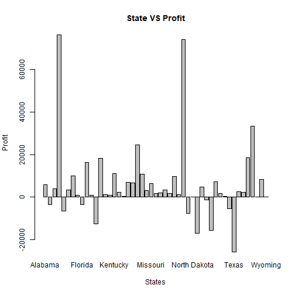

As we see, all the state names aren't visible, so we will try to make a plot for **profit** in each **region** of the country.


```r
region_profit <- aggregate(Profit~Region, data = store_data, sum)
barplot(region_profit$Profit, names.arg = region_profit$Region, xlab = "Region", ylab = "Profit", main = "Region VS Profit")
```

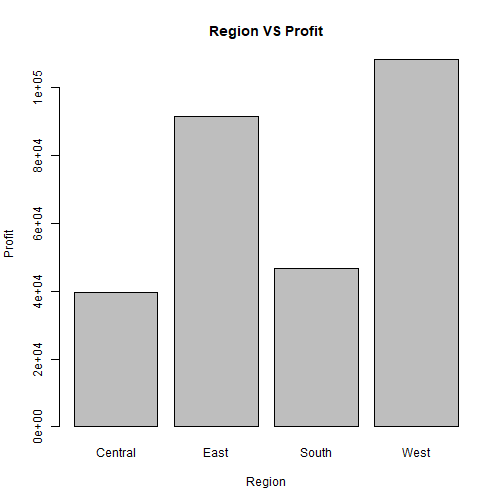

This shows that the maximum profit was earned in the **west** region, and hence, making an investment in that region can be fairly successful.

Now we will try to make a comparision of the data for **Profit** on each **State** based on **Region**


```r
region_state_profit <- aggregate(Profit~Region+State, data = store_data, sum)
barplot(region_state_profit$Profit, names.arg = region_state_profit$State, col = region_state_profit$Region, main = "Profit of the States as per the Regions")
legend("topright", legend = unique(region_state_profit$Region), col = c("green", "blue", "red", "black"), pch =  19)
```

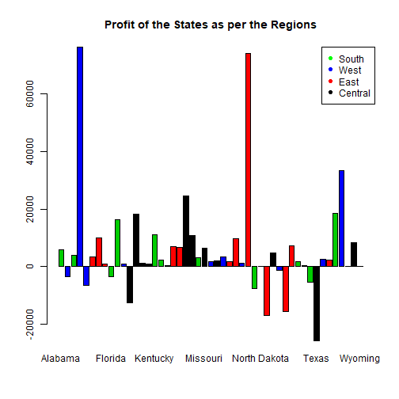

Making another graph just to demonstrate the comparision of **Region**, **State** and **Profit**


```r
qplot(Region, Profit, data = region_state_profit, color = State, main = "Profit based on Region and States")
```

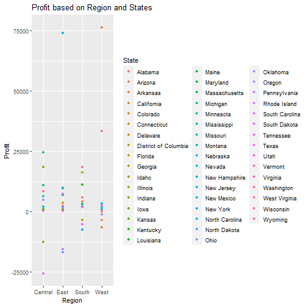

We now make 2 new variables that store the profit and loss in each state. The variables are named as **profit** and **loss** respectively.


```r
loss <- subset(store_data, Profit <= 0)
profit <- subset(store_data, Profit > 0)
```

We now check for the **dimenssions** of both the variables, i**profit** and **loss**.


```r
dim(loss)
```

```
## [1] 1936   13
```

The dimenssion of **loss** came out to be 1936*13.


```r
dim(profit)
```

```
## [1] 8058   13
```

The dimenssion of **profit** came out to be 8058*13.

Now we make the plot for just the **profit** data of each **State**


```r
qplot(Profit, State, data = profit, alpha = 0.5, main = "Profit VS State")
```

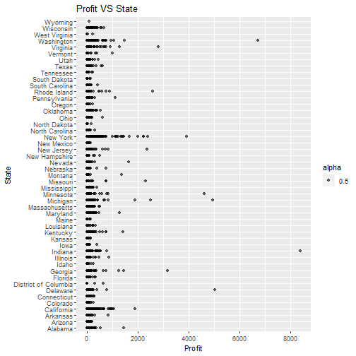

So we see that higest single **profit amount** was seen in the **State of Indiana**. Now we go on to plot the the individual **loss** amount data as per each state.


```r
qplot(Profit, State, data = loss, alpha = 0.5, main = "Loss VS State", xlab = "Loss")
```

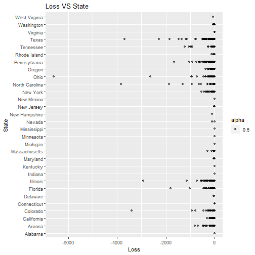

We see that the highest **individual loss** was incurred in the **State of Ohio**. But this dosent mean that the highest total loss was incurred in the same state. For that we aggregate the **profit** and **loss** data as per the states.


```r
profit_state <- aggregate(Profit~State+Region, data = profit, sum)
loss_state <- aggregate(Profit~State+Region, data = loss, sum)
```

Now we will make a plot for both **total profit** and **total loss** according to the states.


```r
qplot(Profit, State, data = profit_state, main = "Total Profit VS State", color = Region)
```

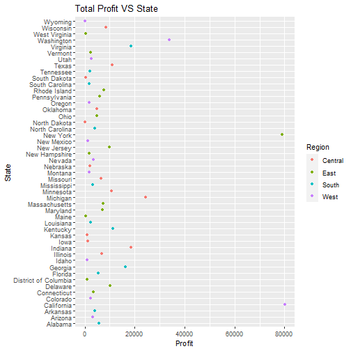

```r
qplot(Profit, State, data = loss_state, main = "Total Loss VS State", xlab = "Loss", color = Region)
```

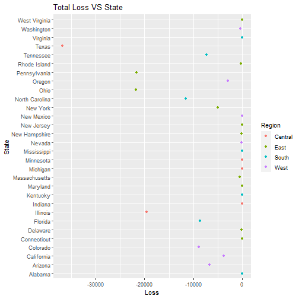

So we see that the **highest Profitable State** is **California** followed by **Ney York** and the state with the higest **loss** is **Texas**.

Now we make a more informative plot for the **Region** and the **Profit** data


```r
qplot(Profit, data = region_state_profit, fill = Region, main = "Profit VS Region")
```

```
## `stat_bin()` using `bins = 30`. Pick better value with `binwidth`.
```

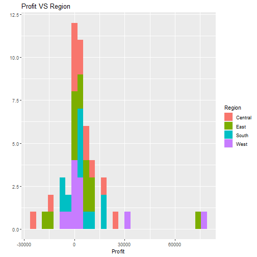

So we see that most of the profit for the **Central** region is focussed around **Zero**

Now we check the **Profit** based on the **Category** and **Sub Category**


```r
profit_sub_cat <- aggregate(Profit ~ Category+Sub.Category, data = store_data, sum)
barplot(profit_sub_cat$Profit, names.arg = profit_sub_cat$Sub.Category, main = "Profit VS Sub Category", xlab = "Sub Category", ylab = "Total Profit")
```

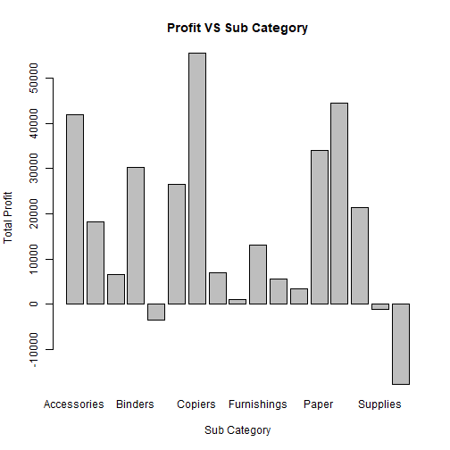

```r
qplot(Profit, Sub.Category, data = store_data, alpha = 0.5, color = Category, ylab = "Sub Category", main = "Profit VS Sub Category")
```

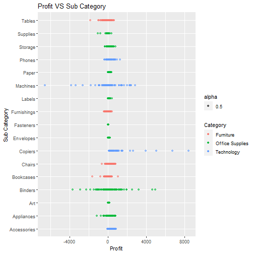

```r
qplot(Profit, Sub.Category, data = profit_sub_cat, main = "Total Profit VS Sub Category", ylab = "Sub Ctaegory", xlab = "Total Profit", color = Category)
```

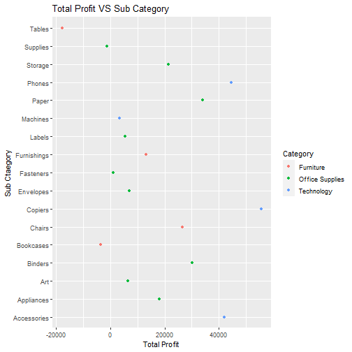

We see that **Copier** gives the higest profit and **Tables** give the highest discount.  

Now we will make graphs related to the **quantity** of the product sold based on the **Category**, which will show us what are the products that we should focus on for **manufacturing** purposes.  

First we will see how much **Quantity** is required in each **Segment**


```r
seg_quan <- aggregate(Quantity~Segment, data = store_data, sum)
barplot(seg_quan$Quantity, names.arg =  seg_quan$Segment, xlab = "Segment", ylab = "Quantity sold", main = "Quantity VS Segment")
```

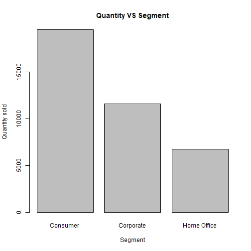

As we see the largest **Quantity** requirement is by the **Consumer** segment.  

Now we focus on the category of the product and the **Quantity** of sale of each product.

```r
quan_sub_cat <- aggregate(Quantity ~ Category+Sub.Category, data = store_data, sum)
qplot(Quantity, Sub.Category, data = quan_sub_cat, color = Category, main = "Quantity VS Sub Category", ylab = "Sub Category")
```

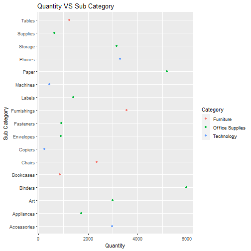

Now we check for the **Quantity** of each **sub categpory** as per the **Segment**


```r
sub_seg_quan <- aggregate(Quantity ~ Sub.Category+Segment, data = store_data, sum)
qplot(Quantity, data = sub_seg_quan, fill = Sub.Category, facets = Segment~., main = "Quantity of the Segments")
```

```
## `stat_bin()` using `bins = 30`. Pick better value with `binwidth`.
```

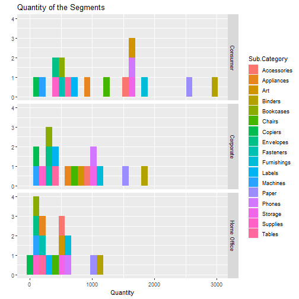

Now we move on to checking the **profit** based on **Category**, **Sub Category** and **Segment**.  
First we move on to the **profit** provided by each **segment**


```r
seg_profit <- aggregate(Profit~Segment, data = store_data, sum)
barplot(seg_profit$Profit, names.arg = seg_profit$Segment, xlab = "Segments", ylab = "Total Profit", main = "Profit in Each Segment")
```

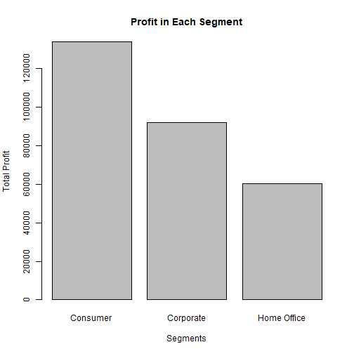

Now we move on to findind the **Profit** as per the **Category** and **Segment**


```r
qplot(Profit, Segment, data = store_data, color = Category, alpha = 0.5)
```

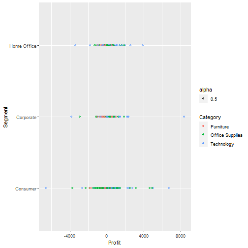

```r
seg_cat_profit <- aggregate(Profit~Segment+Category, data = store_data, sum)
qplot(Profit, data = seg_cat_profit, fill = Category, facets = Segment~., main = "Profit according to Segments")
```

```
## `stat_bin()` using `bins = 30`. Pick better value with `binwidth`.
```

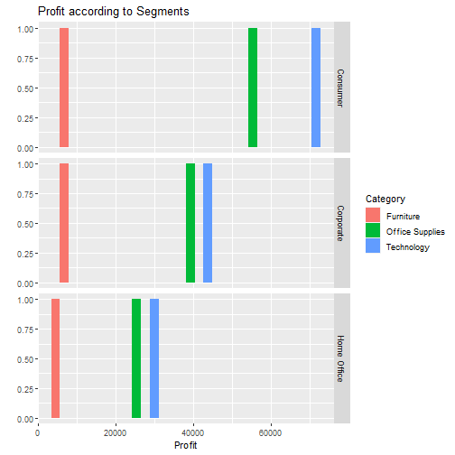


```r
ggplot(store_data, aes(log10(Profit), Segment, color = Category)) + geom_boxplot() + labs(title = "Profit VS Segment", x = "log of Profit")
```

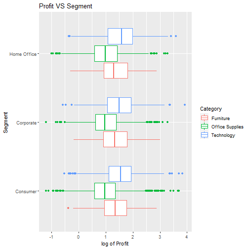

Checking the **Shipping Mode** with the **Profit** can be a key aspect of the **Explorotory Analysis**.  


```r
ship_profit <- aggregate(Profit~Ship.Mode, data = store_data, sum)
barplot(ship_profit$Profit, names.arg = ship_profit$Ship.Mode, xlab = "Shipping Mode", ylab = "Total Profit", main = "Profit VS Shipping Mode")
```

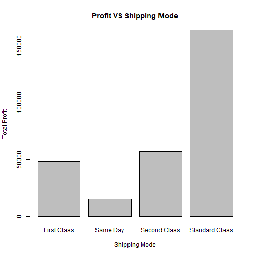

We now look at the explore the **Shipping Mode** data with **Profit** based on the **Category** and **Region**.


```r
ggplot(data = store_data, aes(Ship.Mode, Profit, color = Category)) + geom_point(aes(alpha = 0.5)) + facet_wrap(~Region, nrow = 4, ncol = 1) + labs(title = "Shipping Mode and Profit according to the Category as per Region", x = "Shipping Mode")
```

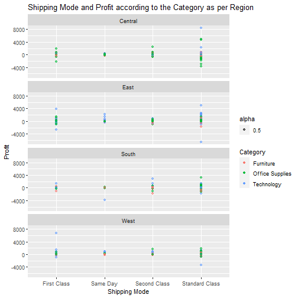

We now move on to checking the **Profit** based on the **Category**, **Segment** and **Region**, and we do that by making a new variable, namely **profit_cat_seg_reg**.


```r
profit_cat_seg_reg <- aggregate(Profit ~ Region+Category+Segment, data = store_data, sum)
ggplot(profit_cat_seg_reg, aes(x = Region, y = Profit, color = Category)) + geom_point() + facet_wrap(~Segment, nrow = 3, ncol = 1) + labs(title = "Profit per Region as per Category and Segment")
```

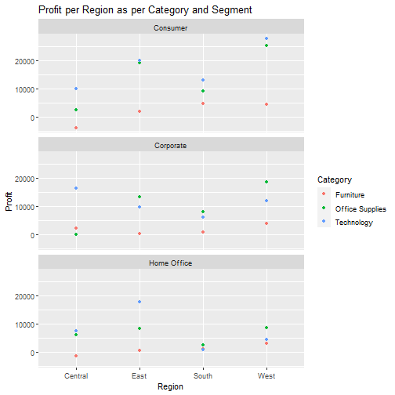

#### We see that one of the highest profits in each section are:  
##### Consumer  
1. **West** - Higest profit by *Technology* followed by *Office Supplies* and *Furniture*  
2. **South** - Higest profit by *Technology* followed by *Office Supplies* and *Furniture*  
3. **East** - Higest profit by *Technology* followed by *Office Supplies* and *Furniture*  
4. **North** - Higest profit by *Technology* followed by *Office Supplies* and *Furniture*  

##### Corporate
1. **West** - Higest profit by *Office Supplies* followed by *Technology* and *Furniture*  
2. **South** - Higest profit by *Office Supplies* followed by *Technology* and *Furniture*  
3. **East** - Higest profit by *Office Supplies* followed by *Technology* and *Furniture*  
4. **North** - Higest profit by *Technology* followed by *Furniture* and *Office Supplies*

##### Home Office
1. **West** - Higest profit by *Office Supplies* followed by *Technology* and *Furniture*  
2. **South** - Higest profit by *Office Supplies* followed by *Furniture* and *Technology*  
3. **East** - Higest profit by *Technology* followed by *Office Supplies* and *Furniture*  
4. **North** - Higest profit by *Office Supplies* followed by *Technology* and *Furniture*  

## **3. Summary**
### Few key points that we notice based on the Profit:
1. **Profit** is maximum in the **Western Region** of the country.  
2. The maximum profits in all the **States** comes from the **State of California(West)** followed by **New York(East)**
3. The maximum profit was earned by selling the **copiers**.
4. The Quantity of product bought was most by the **Consumers segment** followed by **Corporate** and **Home Offices segments**
5. The products sold in the:
a. **Furnishing Category**: Maximum was **Furnishings**, Minimum was **Bookcases**  
b. **Office Supplies**: Maximum was **Binders**, Minimum was **Tables**  
c. **Technology**: Maximum was **Phones**, Minimum was **Copiers**
6. For all the **Segments**, **Technology is the most profitable category**, followed by **Office Supplies** and **Furniture**.
7. We see that the **Standard Shipping** is the most profitable **Shipping Mode** in all the **Categories**. But it is important to note that **Data** provided for making an analysis of the **Shipping Mode** depence on **Profit** is quite **insufficient**, because the **Shipping mode** depends on a lo*t of other external factors.

### Few key points that we notice based on the Loss:
1. **Profit** is minimum in the **Central Region** of the country.
2. The states of **Texas(Central)**, **Pensylvania(East)** and **Ohio(East)** incurred the highest amount of **loss.**
3. Highest **Losses** are incurred in selling the **Tables(Furniture)**, **Bookcases(Furniture)** and **Supplies(Office Supplies)** respectively. 
4. We see that the **Quantity** of **Copiers(Technology)** sold is the least, but still it was able to give the highest **profit**. This is a key point, and the copany should advertise the **Copier** more and produce it in ample amount, so that they can increase their **profit**.
5. We see that the profit for by the **Furniture Category** is least in all the **Segments**, so, we can use this analysis to make the **Furniture** only when ordered and as **Furniture** is a **depleting comodity**, it is advisable not to store it for a long time. The company can hence invest the money saved into making new **Technology**, so that **more profit can be made out of the same investment**.
